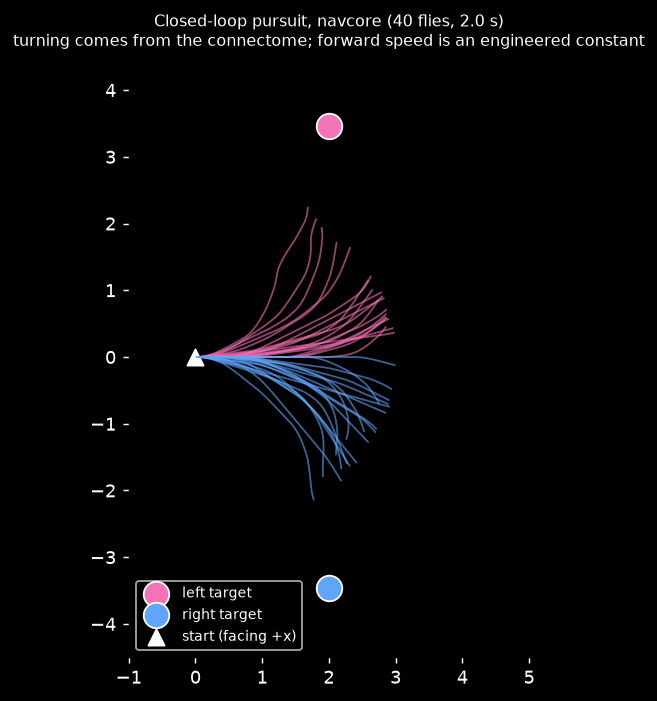

# Phase 2 report: the first closed loop

*2026-09-13 (overnight session). Numbers come from `docs/phase2_*.json`. The graph is navcore (22,686 neurons) with consensus neurotransmitter labels.*

## TL;DR

Two closed-loop tests: **world → senses → connectome LIF brain → motor decoder → body → world**, repeated every 20 ms.

1. **Seeker pursuit.** A fly sees a target 60° to one side.
   - **88%** of flies turn toward it within 1 s (mean **+21.6°**).
   - Blind flies: **0%**. Ten shuffled-wiring brains: **0–23%** (mean turn −0.9° to +3.5°).
   - Real vs blind: p = 9×10⁻¹¹. The real result beats all 10 shuffles, so the empirical p is 1/11 (the minimum possible with 10).
2. **Hider escape.** A threat approaches from one side.
   - **100%** (40/40) of flies trigger the giant-fiber dash before contact; peak DNp01 is 94 Hz.
   - Blind flies: **0%**. All 10 shuffled brains: **0%** (peak DNp01 ≤ 9 Hz).
3. **Pre-registered criterion met:** correct-turn rate ≥ 70% (it was 88%).

## What's engineered vs. what comes from the connectome

| Piece | Source | Disclosure |
|---|---|---|
| Turning direction and size | **Connectome.** DNa02 / DNa03 / DNg13 left-right rates → decoder | Decoder weights are hand-set starting values (`config/motors.yaml`), not fitted to these tests |
| Escape dash trigger | **Connectome.** DNp01 rate crossing a threshold | Threshold (60 Hz) is hand-set |
| Forward speed | **Engineered constant**, 1.5 units/s | The forward-candidate DNs get no sensory drive (Phase 1 §4.5) |
| Vision → neurons | Engineered encoder. Side-level (not retinotopic) Poisson drive: LC10a ≤ 25 Hz by angular size; LC4+LPLC2 ≤ 100 Hz by angular expansion | Rate caps come from the Phase 1 shuffle tests |
| Left/right mapping | Assumes `somaSide` L is the fly's left (FlyEM convention) | If reversed, pursuit would turn *away* from targets; the observed behavior is consistent with the assumption |

## Setup

**Code:**
- `flyseek/world/grid.py`: occupancy grid and ray casting
- `flyseek/motors/body_kinematic.py`: unicycle body with wall sliding
- `flyseek/motors/decoders.py`: EMA-smoothed DN rates → speed / turn / dash
- `flyseek/senses/vision.py`: vision encoder
- `flyseek/agents/fly_agent.py`: one batch column per fly
- `flyseek/world/replay.py`: replay recorder
- Tests: `tests/test_world_motor_vision.py` (6 passing), alongside the 8 LIF tests

**Pursuit** (`experiments/arena_pursuit.py`):
- 10×10 arena. Each fly starts at the origin facing +x.
- A static target (radius 0.3) sits 4 units away at ±60°.
- 20 left + 20 right trials, 2 s, independent Poisson input per fly.
- Mean target input: 14.1 Hz.

**Escape** (`experiments/arena_escape.py`):
- 12×12 arena. A threat (radius 0.4) starts 5 units away at ±90° and homes in on the fly at 2.5 units/s.
- 20 + 20 trials.

## Results

### Pursuit (`phase2_arena_pursuit.json`)

| Condition | Correct turn at 1 s | Mean turn toward target | Closest approach |
|---|---|---|---|
| real | **0.88** (L 0.85, R 0.90) | **+21.6°** | 2.43 |
| blind | 0.00 | 0.0° | 3.46 |
| shuffles 0–9 | 0.00, 0.00, 0.00, 0.23, 0.03, 0.00, 0.00, 0.00, 0.00, 0.12 | −0.9° … +3.5° | 3.30–3.48 |

### Escape (`phase2_arena_escape.json`)

| Condition | Dash before contact | Peak DNp01 |
|---|---|---|
| real | **1.00** (L 1.00, R 1.00) | 94.2 Hz |
| blind | 0.00 | 0.0 Hz |
| shuffles 0–9 | 0.00 (all) | 0.0–9.1 Hz |

### Replay size

The pursuit replay stores all navcore spikes for 40 flies over 100 ticks (2 s) in **177 KB** (compressed, 101k spike entries).

Rough extrapolation: a 5-minute match with 4 navcore flies is ~7 MB. Full-graph flies will be larger (to be measured in Phase 3), but this is far below the 500 MB fallback threshold.

## Honest caveats

- **The controls don't turn at all; they don't turn randomly.** At these input rates only the real wiring carries the signal to DNs. The comparison is "responds vs. doesn't respond", not "right vs. wrong direction". The shuffle null is still the right control: same degree sequence and weights, different targets.
- **10 shuffles cap the empirical p at 0.09.** More shuffles are cheap (~30 s each) if needed for publication.
- **Turns are gentle.** No fly reaches its target in 2 s. Turn gain is a decoder parameter for Phase 4 training.
- **Escape fires early:** ~1.6 s before contact, when the threat is still ~4 units away. The giant fiber is very sensitive, since Phase 1 showed that even 10 Hz of looming input drives DNp01 by +66 Hz. For gameplay, Hiders would bolt from any approaching Seeker. The dash threshold and looming gain need calibration in Phase 3/4.
- **Side-level vision:** the encoder isn't retinotopic.
- **One seed per condition.** Trials within a condition are independent Poisson draws, but the replicates share network state initialization, which is identical for all.

## Phase 2 checklist status

- [x] Kinematic body
- [x] Motor decoder
- [x] Vision encoder
- [x] Agent loop
- [x] Arena pursuit test, with success criterion met
- [x] Replay recorder
- [x] **Added:** escape test
