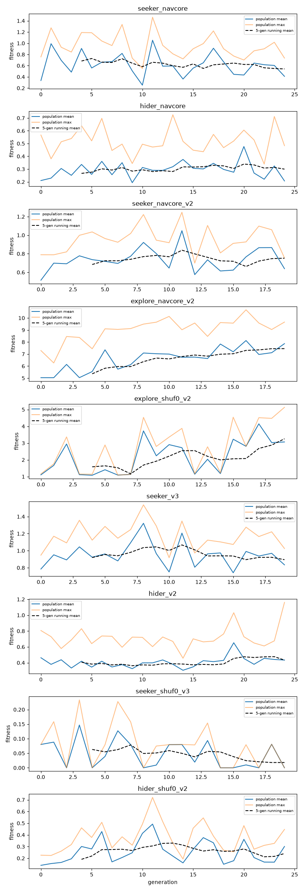

# Phase 5 overnight status

_Generated 2026-09-19 11:43. Regenerated after every pipeline stage; see `C:\flyseek-data\phase5_overnight.log`._

## Pipeline stages

```
[stage] 2026-09-14 22:13 0 waiting for running seeker eval (pid 27560) and hider_navcore training (pid 28256)
[stage] 2026-09-15 00:54 1 hider_navcore (resume/finish)
[stage] 2026-09-15 00:54 2 held-out hider evaluation
[stage] 2026-09-15 01:54 3 seeker_navcore did NOT beat the explorer (decision=retrain) -> seeker_navcore_v2 (8 matches per candidate)
[stage] 2026-09-15 04:02 3b held-out evaluation of seeker_navcore_v2
[stage] 2026-09-15 09:17 RESTART after Windows Update reboot at 04:22 (pipeline killed during 3b)
[stage] 2026-09-15 09:17 0 waiting for running seeker eval (pid none) and hider_navcore training (pid none)
[stage] 2026-09-15 09:17 1 hider_navcore (resume/finish)
[stage] 2026-09-15 09:18 2 held-out hider evaluation
[stage] 2026-09-15 09:18 3 seeker_navcore did NOT beat the explorer (decision=retrain) -> seeker_navcore_v2 (8 matches per candidate)
[stage] 2026-09-15 09:18 3b held-out evaluation of seeker_navcore_v2
[stage] 2026-09-18 13:21 0 waiting for running seeker eval (pid none) and hider_navcore training (pid none)
[stage] 2026-09-18 13:21 1 hider_navcore (resume/finish)
[stage] 2026-09-18 13:21 2 held-out hider evaluation
[stage] 2026-09-18 13:21 3 seeker_navcore did NOT beat the explorer (decision=retrain) -> seeker_navcore_v2 (8 matches per candidate)
[stage] 2026-09-18 13:21 3b held-out evaluation of seeker_navcore_v2
```

## Training runs

| Run | Generations | Fitness mean, first 5 gens | Fitness mean, last 5 gens | Best single | Seeker win rate, last 5 | Stuck s, last 5 |
|---|---|---|---|---|---|---|
| seeker_navcore | 25 | 0.68 | 0.54 | 1.46 | 0.06 | 47.5 |
| hider_navcore | 25 | 0.27 | 0.30 | 0.73 | 0.95 | 19.5 |
| seeker_navcore_v2 | 20 | 0.68 | 0.75 | 1.25 | 0.16 | 45.0 |
| explore_navcore_v2 | 20 | 5.36 | 7.45 | 10.68 | nan | 14.0 |
| explore_shuf0_v2 | 20 | 1.58 | 3.26 | 5.13 | nan | 39.5 |
| seeker_v3 | 20 | 0.92 | 0.89 | 1.54 | 0.25 | 34.5 |
| hider_v2 | 25 | 0.41 | 0.43 | 1.16 | 0.85 | 18.8 |
| seeker_shuf0_v3 | 20 | 0.06 | 0.02 | 0.23 | 0.00 | 80.7 |
| hider_shuf0_v2 | 25 | 0.19 | 0.24 | 0.72 | 0.97 | 19.2 |



Round-to-round swings mostly reflect which matches were drawn that round (every candidate in a round plays the same seeds). Only the held-out evaluations below decide whether training helped.

## Held-out: `phase5_eval_seeker` (seeker, 40 matches, preset short)

| Condition | Fitness (95% CI) | Seeker wins | Stuck s | vs first condition (diff, paired t p) |
|---|---|---|---|---|
| explorer | 0.664 [0.506, 0.823] | 3/40 | 49.1 | reference |
| trained_best | 0.481 [0.329, 0.633] | 1/40 | 54.7 | -0.184, p=0.034 |
| trained_mean | 0.774 [0.590, 0.958] | 7/40 | 42.3 | +0.110, p=0.22 |
| random | 0.052 [-0.000, 0.104] | 0/40 | 4.0 | -0.612, p=4.2e-09 |
| scripted | 1.486 [1.413, 1.558] | 35/40 | – | +0.821, p=2.9e-14 |
| lc10a_off | 0.519 [0.352, 0.687] | 5/40 | 52.6 | -0.145, p=0.13 |
| pfl3_off | 0.493 [0.337, 0.649] | 1/40 | 65.4 | -0.171, p=0.037 |

## Held-out: `phase5_eval_hider` (hider, 40 matches, preset short)

| Condition | Fitness (95% CI) | Seeker wins | Hider survival s (95% CI) | Stuck s | vs first condition (diff, paired t p) |
|---|---|---|---|---|---|
| explorer | 0.244 [0.180, 0.307] | 39/40 | 21.5 [16.1, 27.0] | 12.8 | reference |
| trained_best | 0.352 [0.282, 0.421] | 39/40 | 31.3 [25.4, 37.2] | 24.7 | +0.108, p=0.015 |
| trained_mean | 0.251 [0.209, 0.293] | 39/40 | 22.2 [18.6, 25.8] | 16.6 | +0.007, p=0.85 |
| random | 0.202 [0.161, 0.243] | 40/40 | 18.2 [14.5, 21.8] | 0.8 | -0.042, p=0.2 |
| scripted | 0.494 [0.431, 0.556] | 35/40 | 42.5 [37.4, 47.7] | – | +0.250, p=5.5e-08 |
| loom_off_trained | 0.292 [0.232, 0.352] | 39/40 | 25.9 [20.7, 31.1] | 20.8 | +0.048, p=0.25 |
| dnp01_off_trained | 0.297 [0.226, 0.368] | 39/40 | 26.3 [20.2, 32.4] | 20.6 | +0.053, p=0.26 |
| pfl3_off_trained | 0.146 [0.122, 0.170] | 40/40 | 13.1 [11.0, 15.3] | 7.2 | -0.098, p=0.0096 |

## Held-out: `phase5_eval_seeker_v2` (seeker, 40 matches, preset short)

| Condition | Fitness (95% CI) | Seeker wins | Stuck s | vs first condition (diff, paired t p) |
|---|---|---|---|---|
| explorer | 0.664 [0.506, 0.823] | 3/40 | 49.1 | reference |
| trained_best | 0.785 [0.612, 0.958] | 7/40 | 45.7 | +0.121, p=0.2 |
| trained_mean | 0.683 [0.518, 0.848] | 5/40 | 44.3 | +0.019, p=0.83 |
| lc10a_off_trained | 0.526 [0.385, 0.667] | 1/40 | 48.4 | -0.139, p=0.074 |
| pfl3_off_trained | 0.486 [0.328, 0.644] | 1/40 | 52.9 | -0.178, p=0.024 |

## Held-out: `phase5_eval_seeker_v3` (seeker, 40 matches, preset short)

| Condition | Fitness (95% CI) | Seeker wins | Stuck s | vs first condition (diff, paired t p) |
|---|---|---|---|---|
| explorer | 1.064 [0.898, 1.229] | 15/40 | 30.6 | reference |
| trained_best | 1.014 [0.848, 1.179] | 13/40 | 34.4 | -0.050, p=0.58 |
| trained_mean | 1.040 [0.865, 1.214] | 14/40 | 30.0 | -0.024, p=0.8 |
| random | 0.052 [-0.000, 0.104] | 0/40 | 4.0 | -1.011, p=6.5e-15 |
| scripted | 1.486 [1.413, 1.558] | 35/40 | – | +0.422, p=1.7e-06 |
| lc10a_off_trained | 0.943 [0.787, 1.098] | 11/40 | 34.8 | -0.121, p=0.22 |
| pfl3_off_trained | 0.567 [0.389, 0.744] | 2/40 | 45.3 | -0.497, p=6.9e-06 |

## Held-out: `phase5_eval_hider_v2` (hider, 40 matches, preset short)

| Condition | Fitness (95% CI) | Seeker wins | Hider survival s (95% CI) | Stuck s | vs first condition (diff, paired t p) |
|---|---|---|---|---|---|
| explorer | 0.343 [0.275, 0.412] | 36/40 | 29.4 [24.0, 34.8] | 11.9 | reference |
| trained_best | 0.472 [0.405, 0.540] | 34/40 | 39.9 [35.0, 44.7] | 18.1 | +0.129, p=0.0059 |
| trained_mean | 0.550 [0.465, 0.635] | 30/40 | 45.4 [39.4, 51.3] | 25.8 | +0.207, p=0.0002 |
| random | 0.202 [0.161, 0.243] | 40/40 | 18.2 [14.5, 21.8] | 0.8 | -0.142, p=0.00046 |
| scripted | 0.494 [0.431, 0.556] | 35/40 | 42.5 [37.4, 47.7] | – | +0.150, p=0.0014 |
| loom_off_trained | 0.530 [0.439, 0.621] | 31/40 | 42.8 [37.0, 48.7] | 20.3 | +0.187, p=0.0015 |
| dnp01_off_trained | 0.493 [0.412, 0.574] | 33/40 | 41.4 [35.6, 47.1] | 20.6 | +0.150, p=0.002 |
| pfl3_off_trained | 0.165 [0.136, 0.194] | 40/40 | 14.9 [12.3, 17.5] | 7.3 | -0.178, p=9.2e-06 |

## Held-out: `phase5_eval_seeker_shuffle_v3` (seeker, 40 matches, preset short)

| Condition | Fitness (95% CI) | Seeker wins | Stuck s | vs first condition (diff, paired t p) |
|---|---|---|---|---|
| explorer | 1.064 [0.898, 1.229] | 15/40 | 30.6 | reference |
| trained_best | 0.970 [0.815, 1.126] | 9/40 | 34.9 | -0.093, p=0.28 |
| shuf_trained | 0.016 [-0.016, 0.047] | 0/40 | 80.7 | -1.048, p=5.8e-15 |

## Held-out: `phase5_eval_hider_shuffle_v2` (hider, 40 matches, preset short)

| Condition | Fitness (95% CI) | Seeker wins | Hider survival s (95% CI) | Stuck s | vs first condition (diff, paired t p) |
|---|---|---|---|---|---|
| explorer | 0.337 [0.271, 0.403] | 37/40 | 29.2 [23.9, 34.5] | 11.9 | reference |
| trained_best | 0.507 [0.428, 0.586] | 33/40 | 42.2 [37.1, 47.4] | 19.7 | +0.170, p=0.00071 |
| shuf_trained | 0.220 [0.176, 0.263] | 40/40 | 19.8 [15.8, 23.7] | 17.5 | -0.117, p=0.0022 |
